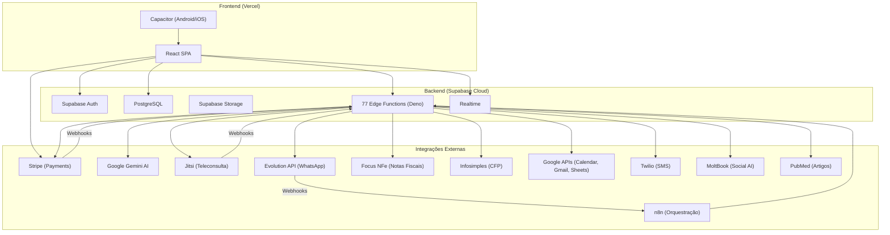
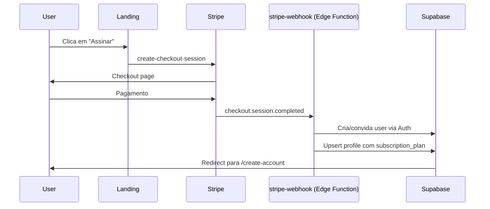
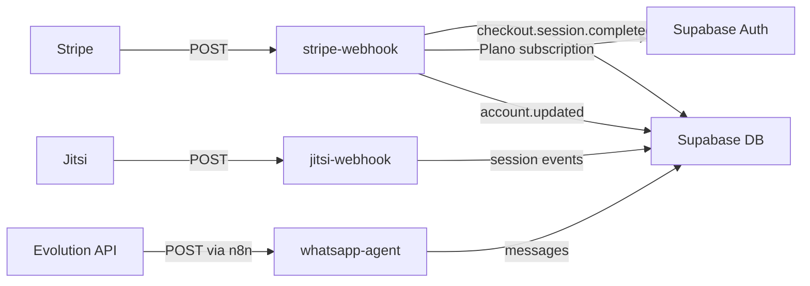
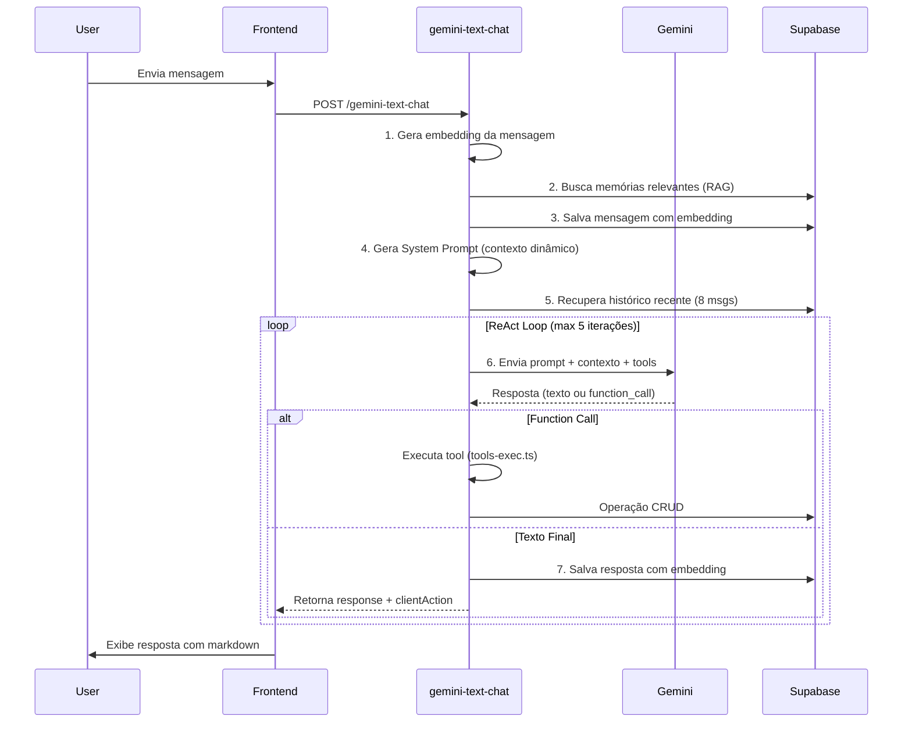

# 🧠 NeuronEx — Arquitetura Completa

> **Última atualização:** 10 de Fevereiro de 2026
> **Versão:** v1.0 — Documento gerado por varredura automatizada do código-fonte.

---

## 1. Visão Geral

**NeuronEx** é uma plataforma SaaS completa para **psicólogos e clínicas de psicologia**, cobrindo desde gestão de pacientes, agenda, financeiro, teleconsulta, até inteligência artificial avançada (Synapse AI). A aplicação é construída como uma **SPA (Single Page Application)** com suporte mobile nativo via Capacitor.

### Stack Tecnológico

| Camada | Tecnologia |
|---|---|
| **Frontend** | React 18 + TypeScript + Vite |
| **Estilização** | Tailwind CSS 3 + Radix UI + shadcn/ui |
| **Roteamento** | React Router DOM v6 |
| **Estado & Data Fetching** | TanStack React Query v5 |
| **Animações** | Framer Motion |
| **Editor Rich Text** | TipTap |
| **Gráficos** | Recharts + FullCalendar |
| **3D / Visuais** | React Three Fiber + Three.js |
| **Backend (BaaS)** | Supabase (PostgreSQL + Auth + Storage + Edge Functions) |
| **Pagamentos** | Stripe (Connect + Checkout + Webhooks) |
| **IA Generativa** | Google Gemini (via Edge Functions) |
| **Teleconsulta** | Jitsi (JaaS - Jitsi as a Service) |
| **WhatsApp** | Evolution API + n8n |
| **Assinatura Digital** | *(Removido)* |
| **Nota Fiscal** | Focus NFe |
| **Validação CRP** | Infosimples API |
| **SMS** | Twilio |
| **Email** | Gmail API (via Google OAuth) |
| **Rede Social IA** | MoltBook |
| **Mobile** | Capacitor (Android + iOS) |
| **Hospedagem Frontend** | Vercel |
| **CI/CD** | Vercel (auto-deploy) |

---

## 2. Arquitetura de Alto Nível



---

## 3. Mapa de Rotas & Páginas

### 3.1 Rotas Públicas (sem autenticação)

| Rota | Componente | Descrição |
|---|---|---|
| `/` | `Index.tsx` | Landing page principal |
| `/auth` | `AuthPage.tsx` | Login / Registro |
| `/create-account` | `CreateAccount.tsx` | Criação de conta (pós-Stripe) |
| `/account-created` | `AccountCreated.tsx` | Confirmação de conta criada |
| `/email-confirmed` | `EmailConfirmedPage.tsx` | Confirmação de email |
| `/reset-password` | `ResetPasswordPage.tsx` | Reset de senha |
| `/google-connection-success` | `GoogleConnectionSuccess.tsx` | Callback OAuth Google |
| `/confirmar-agendamento/:token` | `ConfirmAppointment.tsx` | Paciente confirma consulta (público, por token) |
| `/join/:appointmentId` | `JoinSession.tsx` | Paciente entra na teleconsulta |
| `/payment/callback` | `PaymentCallback.tsx` | Callback pós-pagamento Stripe |

### 3.2 Páginas Institucionais (públicas)

| Rota | Componente | Descrição |
|---|---|---|
| `/about` | `About.tsx` | Sobre a NeuronEx |
| `/blog` | `Blog.tsx` | Blog com artigos |
| `/careers` | `Careers.tsx` | Página de vagas |
| `/contact` | `Contact.tsx` | Formulário de contato |
| `/help` | `HelpCenter.tsx` | Central de ajuda |
| `/newsletter` | `Newsletter.tsx` | Assinatura de newsletter |
| `/neurobank` | `FinanceLanding.tsx` | Landing page do módulo financeiro |

### 3.3 Páginas Legais (públicas)

| Rota | Componente | Descrição |
|---|---|---|
| `/legal` | `Legal.tsx` | Visão geral legal |
| `/politica-de-privacidade` | `PoliticaDePrivacidade.tsx` | Política de privacidade |
| `/termos-de-uso` | `TermosDeUso.tsx` | Termos de uso |
| `/configuracoes-de-cookies` | `ConfiguracoesDeCookies.tsx` | Configuração de cookies |

### 3.4 Rotas Protegidas (Profissional — `ProtectedRoute`)

| Rota | Componente | Descrição |
|---|---|---|
| `/dashboard` | `Dashboard.tsx` | Painel principal com KPIs e alertas |
| `/agenda` | `Agenda.tsx` | Calendário com FullCalendar |
| `/pacientes` | `Pacientes (index.tsx)` | Lista de pacientes |
| `/pacientes/:id` | `PatientDetail.tsx` | Prontuário detalhado do paciente |
| `/notas` | `Notes.tsx` | Caderno de notas pessoais e clínicas |
| `/financeiro` | `Financeiro.tsx` | Gestão financeira completa |
| `/ajustes` | `Ajustes.tsx` | Configurações do perfil e integrações |
| `/teleconsulta` | `Teleconsulta.tsx` | Sala de teleconsulta Jitsi |
| `/synapse-ai` | `AIChat.tsx` | Chat com a IA Synapse (Gemini) |
| `/neurozap` | `WhatsAppAgent.tsx` | Painel do agente WhatsApp IA (tela cheia) |

### 3.5 Rotas do Plano Clínica (`ProtectedRoute`)

| Rota | Componente | Descrição |
|---|---|---|
| `/clinic-dashboard` | `ClinicDashboard.tsx` | Dashboard administrativo da clínica |
| `/relatorios` | `PerformanceReports.tsx` | Relatórios de performance multi-profissional |

### 3.6 Portal do Paciente (`PatientProtectedRoute`)

| Rota | Componente | Descrição |
|---|---|---|
| `/portal` | `PatientPortal.tsx` | Portal self-service do paciente |

### 3.7 Páginas Mobile (Capacitor)

| Componente | Descrição |
|---|---|
| `MobileIndex.tsx` | Landing mobile |
| `MobileAuth.tsx` | Login mobile |
| `MobileDashboard.tsx` | Dashboard mobile |
| `MobileAgenda.tsx` | Agenda mobile |
| `MobilePacientes.tsx` | Lista de pacientes mobile |
| `MobilePatientDetail.tsx` | Detalhe do paciente mobile |
| `MobileFinanceiro.tsx` | Financeiro mobile |
| `MobileNotes.tsx` | Notas mobile |
| `MobileAIChat.tsx` | Chat IA mobile |
| `MobileTeleconsulta.tsx` | Teleconsulta mobile |
| `MobilePatientPortal.tsx` | Portal do paciente mobile |
| `MobileIntegrations.tsx` | Integrações mobile |

---

## 4. Arquitetura de Componentes

### 4.1 Módulos de Componentes (25 domínios)

```
src/components/
├── agenda/          (20 arquivos) — Calendário, slots, agendamento
├── ai-chat/         (24 arquivos) — Interface do Synapse AI
├── animations/      (1 arquivo)  — Animações globais
├── auth/            (7 arquivos)  — Autenticação, provedores, guards
├── clinic/          (6 arquivos)  — Dashboard e gestão clínica
├── dashboard/       (23 arquivos) — Widgets, alertas, métricas
├── financeiro/      (41 arquivos) — Transações, faturas, gráficos, NFe
├── icons/           (1 arquivo)   — Ícones customizados
├── integrations/    (1 arquivo)   — Componentes de integrações
├── landing/         (12 arquivos) — Hero, showcase, pricing, CTA
├── layout/          (12 arquivos) — Sidebar, topbar, scroll, layout
├── network/         (2 arquivos)  — Grafo neural de conexões
├── notes/           (32 arquivos) — Editor TipTap, pastas, módulos
├── onboarding/      (10 arquivos) — Tour, wizard, validação CRP
├── patient-portal/  (9 arquivos)  — Interface self-service do paciente
├── patients/        (28 arquivos) — Cards, detalhes, timeline, metas
├── reports/         (1 arquivo)   — Relatórios de performance
├── settings/        (14 arquivos) — Ajustes de perfil, integrações
├── setup-wizard/    (5 arquivos)  — Configuração inicial (onboarding)
├── subscription/    (4 arquivos)  — Planos, upsell, modal de upgrade
├── teleconsulta/    (18 arquivos) — Lobby, sala, controles, biofeedback
├── theme/           (3 arquivos)  — ThemeProvider, toggle, transição
├── ui/              (58 arquivos) — Biblioteca shadcn/ui completa
├── utils/           (1 arquivo)   — Utilitários de componentes
└── whatsapp/        (7 arquivos)  — Simulador, conversas, configurações
```

### 4.2 Provedores de Contexto (Provider Tree)

```
QueryClientProvider
  └── ThemeProvider (dark por padrão)
       └── SessionContextProvider (Supabase Auth)
            └── BrowserRouter
                 └── AIProvider (contexto inteligente por rota)
                      └── SubscriptionProvider (plano & features)
                           └── TourProvider (onboarding guiado)
                                └── TooltipProvider
                                     └── <Routes />
```

---

## 5. Sistema de Planos & Assinatura

### 5.1 Planos Disponíveis

| Feature | Essential | Professional | Clinic |
|---|:---:|:---:|:---:|
| Máx. Pacientes | 5 | ∞ | ∞ |
| Synapse AI (Copilot) | ❌ | ✅ | ✅ |
| Telemedicina HD | ❌ | ✅ | ✅ |
| Gestão Financeira Avançada | ❌ | ✅ | ✅ |
| Portal do Paciente | ❌ | ✅ | ✅ |
| Múltiplos Profissionais | ❌ | ❌ | ✅ |
| Dashboard Admin | ❌ | ❌ | ✅ |
| Relatórios de Performance | ❌ | ❌ | ✅ |
| API & Integrações | ❌ | ❌ | ✅ |

### 5.2 Fluxo de Assinatura



---

## 6. Banco de Dados (PostgreSQL via Supabase)

### 6.1 Tabelas Principais

| Tabela | Descrição | RLS |
|---|---|:---:|
| `profiles` | Perfil do profissional (nome, CRP, avatar, plano, preferências IA) | ✅ |
| `patients` | Cadastro de pacientes (nome, CPF, diagnóstico, medicações, risco) | ✅ |
| `appointments` | Agendamentos (data, tipo, status, link Google Meet) | ✅ |
| `session_notes` | Notas de sessão com resumo de IA (sentimento, tópicos, próximos passos) | ✅ |
| `transactions` | Transações financeiras (receita/despesa, método, parcelas, pacote) | ✅ |
| `invoices` | Faturas com integração Stripe + Focus NFe (NFSe) | ✅ |
| `recurring_expenses` | Despesas fixas recorrentes | ✅ |
| `patient_packages` | Pacotes de sessões (total, usadas, valor, prazo) | ✅ |
| `patient_goals` | Metas terapêuticas do paciente | ✅ |
| `personal_notes` | Caderno pessoal do profissional (módulos, tags) | ✅ |
| `reminders` | Lembretes categorizados (Geral, Urgente, Pessoal, Clínico) | ✅ |
| `note_modules` | Módulos/pastas para organização de notas | ✅ |

### 6.2 Tabelas de Chat & IA

| Tabela | Descrição | RLS |
|---|---|:---:|
| `chat_sessions` | Sessões de conversa com Synapse AI | ✅ |
| `messages` | Mensagens do chat (user/assistant/system) com embeddings vector(768) | ✅ |
| `scientific_updates` | Atualizações científicas auto-curadas (arXiv, GitHub) | ✅ |
| `normative_docs` | Base de normas do CFP e Código de Ética | ✅ |
| `normative_chunks` | Chunks vetorizados de normas para busca semântica | ✅ |

### 6.3 Tabelas de WhatsApp

| Tabela | Descrição | RLS |
|---|---|:---:|
| `whatsapp_settings` | Configurações por profissional (instância, API key, ativo) | ✅ |
| `whatsapp_conversations` | Conversas ativas com pacientes | ✅ |
| `whatsapp_messages` | Mensagens inbound/outbound com status | ✅ |

### 6.4 Tabelas de Organização (Plano Clinic)

| Tabela | Descrição | RLS |
|---|---|:---:|
| `organizations` | Clínicas (nome, slug, logo, proprietário, plano) | ✅ |
| `organization_members` | Membros (role: admin/professional/receptionist/viewer, permissões JSON) | ✅ |
| `organization_invitations` | Convites com token e expiração | ✅ |

### 6.5 Tabelas de Integração

| Tabela | Descrição | RLS |
|---|---|:---:|
| `user_stripe_accounts` | Contas Stripe Connect por profissional | ✅ |
| `google_tokens` | Tokens OAuth do Google (Calendar, Gmail, Sheets) | ✅ |
| `patient_portal_access` | Acessos do portal do paciente | ✅ |
| `patient_invitations` | Convites para o portal do paciente | ✅ |
| `patient_mood_logs` | Registro de humor do paciente (mood score) | ✅ |
| `patient_documents` | Documentos compartilhados (PDF, atestados) | ✅ |
| `moltbook_config` | Configuração do agente MoltBook (IA social) | ✅ |
| `fiscal_settings` | Configurações fiscais (CNPJ, ISS, código serviço) | ✅ |
| `notification_settings` | Preferências de notificação | ✅ |
| `communication_templates` | Templates de comunicação (WhatsApp, Email) | ✅ |
| `audit_logs` | Logs de auditoria de ações críticas | ✅ |

### 6.6 Funcionalidades Avançadas do Banco

- **pgvector** — Extensão para embeddings `vector(768)` (busca semântica via Gemini)
- **RLS (Row Level Security)** — Todas as tabelas com políticas de isolamento por `user_id`
- **Triggers** — Auto-adição de owner como admin em organizações, atualização de `updated_at`
- **RPC** — `match_messages_gemini()` para busca de similaridade coseno nas mensagens

---

## 7. Supabase Edge Functions (77 funções)

### 7.1 Inteligência Artificial

| Função | Descrição |
|---|---|
| `gemini-text-chat` | **Core IA** — Chat com Synapse AI (Gemini + RAG + Tools + Embeddings + Anonimização) |
| `gemini-text-transform` | Transformação de texto via Gemini |
| `generate-summary` | Geração de resumos de sessão |
| `generate-session-prontuario` | Geração de prontuário de sessão |
| `generate-clinical-diagram` | Geração de diagramas clínicos |
| `scientific-updater` | Curadoria automática de artigos científicos (arXiv, GitHub) |
| `ingest-normative` | Ingestão de normas CFP para base de conhecimento |
| `sync-cfp-norms` | Sincronização de normativas do CFP |
| `get-voice-config` | Configuração de voz para IA |

### 7.2 Stripe (Pagamentos & Financeiro)

| Função | Descrição |
|---|---|
| `stripe-webhook` | **Webhook principal** — Processa `checkout.session.completed`, `account.updated`, `payout.paid` |
| `create-checkout-session` | Cria sessão de checkout (assinatura ou pagamento avulso) |
| `create-payment-session` | Sessão de pagamento para pacientes |
| `create-appointment-payment-intent` | PaymentIntent para consultas |
| `verify-checkout-session` | Verifica status do checkout |
| `stripe-connect-init` | Inicializa Stripe Connect para profissional |
| `create-stripe-account-link` | Link de onboarding Stripe Connect |
| `get-stripe-account` | Dados da conta Stripe |
| `get-stripe-account-status` | Status da conta Stripe |
| `get-stripe-balance` | Saldo Stripe |
| `get-stripe-payouts` | Histórico de pagamentos |
| `stripe-create-payout` | Solicita saque |
| `stripe-dashboard-link` | Link do dashboard Stripe |
| `stripe-invoice-generate` | Gera fatura via Stripe |
| `stripe-manage-external-accounts` | Gerencia contas bancárias |
| `stripe-process-split` | Processa split de pagamentos (clínica) |
| `update-stripe-account` | Atualiza conta Stripe |
| `stripe-account-manager` | Gestão avançada da conta |
| `stripe-webhook-handler` | Handler alternativo do webhook |
| `verify-financial-pin` | Verifica PIN financeiro |

### 7.3 WhatsApp / Evolution API

| Função | Descrição |
|---|---|
| `whatsapp-agent` | **Agente IA** — Recebe mensagens via webhook, processa com Gemini, responde via Evolution API |
| `evolution-manager` | **Gerenciador** — Cria instâncias, QR Code, status, envio de mensagens, WebSocket |
| `whatsapp-send` | Envio direto de mensagens |
| `whatsapp-sync` | Sincronização de contatos e conversas |

### 7.4 Google Suite

| Função | Descrição |
|---|---|
| `google-auth-init` | Inicia fluxo OAuth Google |
| `google-auth-callback` | Callback OAuth |
| `google-auth-status` | Verifica status da conexão |
| `google-calendar-sync` | Sincroniza agenda Google |
| `google-calendar-poll` | Polling de eventos |
| `google-calendar-manage` | CRUD de eventos |
| `google-sheets-init` | Inicializa Google Sheets |
| `google-sheets-sync` | Sincroniza dados com planilhas |
| `google-suite-action` | Ações genéricas Google Suite |
| `send-gmail` | Envia emails via Gmail |
| `send-google-invite` | Envia convites Google Calendar |

### 7.5 Teleconsulta (Jitsi)

| Função | Descrição |
|---|---|
| `generate-jitsi-token` | Gera JWT para sala Jitsi |
| `jitsi-token` | Token alternativo |
| `jitsi-guest-token` | Token para convidados |
| `jitsi-branding` | Personalização visual |
| `jitsi-webhook` | **Webhook** — Processa eventos da sala (gravação, entrada) |
| `jitsi-webhook-handler` | Handler alternativo |

### 7.6 Notas Fiscais & Documentos

| Função | Descrição |
|---|---|
| `issue-focus-nfe` | Emite NFe via Focus NFe |
| `issue-invoice-focusnfe` | Emite fatura Focus NFe |
| `check-invoice-status` | Verifica status da NF |

| `send-document-email` | Envia documento por email |

### 7.7 Comunicação & Envios

| Função | Descrição |
|---|---|
| `send-reminder` | Envia lembrete genérico |
| `send-reminder-email` | Lembrete por email |
| `send-appointment-reminder` | Lembrete de consulta |
| `send-session-invite` | Convite de teleconsulta |
| `send-patient-invite` | Convite para portal do paciente |
| `invite-patient` | Convida paciente |
| `invite-patient-user` | Cria acesso de paciente |
| `send-monthly-report` | Relatório mensal automático |
| `twilio-sms` | Envio de SMS via Twilio |

### 7.8 Consultas Públicas & Agendamento

| Função | Descrição |
|---|---|
| `get-public-availability` | Disponibilidade do profissional (público) |
| `get-public-appointment-details` | Detalhes de agendamento público |
| `get-therapist-availability` | Agenda do terapeuta |
| `get-appointment-by-token` | Consulta por token de confirmação |
| `confirm-appointment` | Confirma agendamento |
| `process-public-appointment` | Processa agendamento externo |

### 7.9 Outras

| Função | Descrição |
|---|---|
| `validate-crp` | Valida registro CRP via Infosimples API |
| `delete-user-account` | Exclusão de conta |
| `moltbook-agent` | Agente na rede social de IAs (MoltBook) |
| `twitter-moltbook` | Cross-post para Twitter/X |
| `synapse-heartbeat` | Heartbeat do agente IA |
| `recharge-phone-mock` | Mock para recarga (teste) |

---

## 8. Webhooks (Inbound)



### 8.1 Stripe Webhook (`stripe-webhook`)

- **Eventos processados:**
  - `checkout.session.completed` (mode=payment) → Marca fatura como paga, cria transação, dispara NFe
  - `checkout.session.completed` (mode=subscription) → Convida usuário, cria perfil com plano
  - `account.updated` → Atualiza status de onboarding Stripe Connect
  - `payout.paid` → Log de saque realizado

### 8.2 Jitsi Webhook (`jitsi-webhook`)

- Processa eventos de sala (gravação, entrada de participantes)
- Identifica agendamento pelo FQN (nome da sala)


### 8.4 WhatsApp (via Evolution API → n8n → Edge Function)

- Recebe mensagens inbound
- Processa com Gemini (IA)
- Responde automaticamente via Evolution API
- Salva inbound + outbound no banco

---

## 9. Integrações Externas

### 9.1 Stripe

- **Stripe Checkout** — Pagamentos de consulta e assinatura de planos
- **Stripe Connect** — Cada profissional tem sua conta Stripe separada para receber pagamentos
- **Stripe Payouts** — Saques para conta bancária do profissional
- **Chave pública:** configurada via `VITE_STRIPE_PUBLIC_KEY` (modo live)

### 9.2 Google Suite

- **Google Calendar** — Sincronização bidirecional de agenda
- **Gmail** — Envio de emails (lembretes, convites, documentos)
- **Google Sheets** — Exportação de dados financeiros
- **Google Meet** — Links de reunião via Google Calendar

### 9.3 Evolution API + n8n

- **Evolution API** — Servidor WhatsApp Business (instância auto-gerenciada)
  - URL base: `https://wsapi.dev.neuronex.site`
  - Cria/gerencia instâncias WhatsApp por profissional
  - QR Code → Conexão → WebSocket → Mensagens
- **n8n** — Orquestra webhooks e fluxos
  - Webhook base: `https://webhook.dev.neuronex.site/webhook/neuronex`
  - Pipeline: Extrai professionalId → Busca credenciais → Encaminha para Edge Function

### 9.4 Jitsi (JaaS)

- Gera tokens JWT para salas de teleconsulta
- Branding customizado
- Webhook para eventos de sala

### 9.5 Focus NFe

- Emissão automática de Nota Fiscal de Serviço Eletrônica (NFSe)
- Disparada automaticamente após pagamento confirmado via Stripe


### 9.7 Infosimples API

- Validação do registro CRP (Conselho Regional de Psicologia)
- Busca dados do profissional no CFP (Conselho Federal de Psicologia)
- Múltiplas estratégias de busca (UF, nome, CPF)

### 9.8 Twilio

- Envio de SMS para notificações e lembretes

### 9.9 MoltBook

- Rede social para agentes de IA
- O "Synapse AI" pode postar, comentar, votar e buscar na rede
- Perfil configurável via `moltbook_config`

### 9.10 PubMed

- Busca de artigos científicos e estudos clínicos
- Integrada como tool do Synapse AI

---

## 10. Synapse AI — Arquitetura da IA

### 10.1 Visão Geral

O **Synapse AI** é o copiloto inteligente do NeuronEx, construído sobre o **Google Gemini** com um sistema avançado de **RAG (Retrieval-Augmented Generation)** e **Function Calling** (ReAct loop).

### 10.2 Arquitetura Interna

```
gemini-text-chat/
├── index.ts        — Orquestrador principal (ReAct loop com até 5 iterações)
├── config.ts       — URLs e CORS
├── prompt-gen.ts   — Geração dinâmica de System Prompt (contexto por rota)
├── tools-def.ts    — Definição de 38+ ferramentas (Function Calling)
├── tools-exec.ts   — Execução das ferramentas (90KB de lógica)
├── embeddings.ts   — Geração de embeddings via Gemini
└── anonymizer.ts   — Anonimização de dados sensíveis (LGPD)
```

### 10.3 Ferramentas do Synapse AI (38 tools)

| Categoria | Ferramentas |
|---|---|
| **Pacientes** | `list_patients`, `search_patients`, `report_all_patients`, `get_patient_details`, `create_patient`, `update_patient_info`, `add_patient_medication` |
| **Clínica** | `search_clinical_history`, `generate_patient_insights`, `suggest_treatment_approach`, `detect_risk_patterns`, `create_session_note` |
| **Agenda** | `get_calendar`, `create_appointment`, `reschedule_appointment`, `cancel_appointment`, `find_available_slots` |
| **Financeiro** | `get_financial_metrics`, `list_transactions`, `create_transaction`, `generate_financial_report`, `send_payment_reminder`, `draft_invoice` |
| **Documentos** | `draft_official_document`, `generate_document`, `draft_email` |
| **Conhecimento** | `get_latest_scientific_updates`, `search_normative_docs`, `search_medical_articles`, `search_cid10`, `get_medication_info` |
| **Comunicação** | `send_whatsapp_message`, `read_whatsapp_conversations`, `send_email` |
| **Navegação** | `navigate_system` |
| **MoltBook** | `moltbook_post`, `moltbook_comment`, `moltbook_vote`, `moltbook_feed`, `moltbook_search`, `moltbook_profile`, `moltbook_submolts` |

### 10.4 Fluxo de Processamento



### 10.5 Sistema de Memória

- **Curto prazo (Short-term):** Últimas 8 mensagens da sessão atual
- **Longo prazo (Long-term):** Embeddings vector(768) em todas as mensagens, busca por similaridade coseno via `match_messages_gemini()` (threshold: 0.60)

### 10.6 Anonimização (LGPD)

O módulo `anonymizer.ts` protege dados sensíveis antes de enviar ao Gemini:
- Nomes → pseudônimos
- CPFs → mascarados
- Mapeamento reversível para restaurar na resposta

---

## 11. Hooks (125 hooks customizados)

### Categorias principais:

| Categoria | Exemplos | Qtd |
|---|---|---|
| **Pacientes** | `use-patients`, `use-patient-by-id`, `use-patient-goals`, `use-patient-timeline` | 20+ |
| **Agenda** | `use-appointments`, `use-add-appointment`, `use-add-recurring-appointment` | 10+ |
| **Financeiro** | `use-transactions`, `use-invoices`, `use-projected-cash-flow`, `use-revenue-leakage` | 15+ |
| **Notas** | `use-session-notes`, `use-personal-notes`, `use-note-modules` | 8+ |
| **IA** | `use-ai-chat`, `use-gemini-voice`, `use-speech-recognition`, `use-text-to-speech` | 6+ |
| **Stripe** | `use-stripe-connect`, `use-stripe-balance`, `use-stripe-payouts`, `use-stripe-bank-accounts` | 8+ |
| **WhatsApp** | `use-whatsapp-agent`, `use-evolution-websocket` | 3+ |
| **Google** | `use-google-auth`, `use-google-calendar-sync`, `use-sheets-sync` | 4+ |
| **Teleconsulta** | `use-jitsi-token`, `use-biofeedback`, `use-audio-analyzer`, `use-realtime-presence` | 5+ |
| **Assinatura** | `use-subscription-plan` | 1 |
| **Perfil** | `use-profile`, `use-onboarding`, `use-welcome-onboarding` | 4+ |
| **Utilitários** | `use-mobile`, `use-theme`, `use-toast`, `use-in-view`, `use-smooth-scroll` | 6+ |

---

## 12. Infraestrutura & Deploy

### 12.1 Vercel (Frontend)

- **SPA Rewrite:** Todas as rotas redirecionadas para `index.html`
- **Headers de Segurança:**
  - `X-Content-Type-Options: nosniff`
  - `X-Frame-Options: DENY`
  - `X-XSS-Protection: 1; mode=block`

### 12.2 Capacitor (Mobile)

- **App ID:** `com.example.neuronexai`
- **App Name:** `NeuroNex AI`
- **Web Dir:** `dist` (build output do Vite)
- **Plataformas:** Android + iOS

### 12.3 Supabase Cloud

- **Projeto:** `krewdaklcyzqfxkkgvqr`
- **URL:** `https://krewdaklcyzqfxkkgvqr.supabase.co`
- **77 Edge Functions** deployadas (Deno runtime)
- **4 migrações** versionadas

---

## 13. Segurança

| Aspecto | Implementação |
|---|---|
| **Autenticação** | Supabase Auth (email/password, Google OAuth, magic link) |
| **Autorização** | RLS em todas as tabelas (`auth.uid() = user_id`) |
| **Guards de Rota** | `ProtectedRoute` (profissionais) + `PatientProtectedRoute` (pacientes) |
| **Anonimização IA** | Dados sensíveis anonimizados antes de enviar ao Gemini |
| **Stripe Webhook** | Verificação de assinatura (`stripe-signature`) |
| **CORS** | Headers configurados em todas as Edge Functions |
| **JWT Jitsi** | Tokens JWT temporários para salas de teleconsulta |
| **PIN Financeiro** | Verificação de PIN para operações financeiras sensíveis |
| **Headers HTTP** | `nosniff`, `DENY`, `XSS-Protection` via Vercel |

---

## 14. Documentação Existente

| Arquivo | Conteúdo |
|---|---|
| `docs/DEPLOY_EDGE_FUNCTIONS.md` | Guia de deploy das Edge Functions |
| `docs/EVOLUTION_CONFIG.md` | Configuração da Evolution API |
| `docs/N8N_FIXES.md` | Correções do n8n |
| `docs/NEUROZAP_SETUP.md` | Setup do módulo WhatsApp |
| `docs/NEUROZAP_V2.md` | Documentação v2 do NeuroZap |
| `docs/product/AI_BRAND_MANUAL.md` | Manual de marca da IA |
| `docs/product/OVERVIEW_DIFERENCIAIS.md` | Diferenciais do produto |
| `docs/n8n/` | 16 arquivos (JSONs de nodes n8n + instruções) |
| `docs/design-guidelines/` | 11 arquivos de design system |

---

## 15. Diagrama de Domínios

```mermaid
mindmap
  root((NeuronEx))
    Gestão de Pacientes
      Cadastro & Prontuário
      Timeline Clínica
      Metas Terapêuticas
      Medicações
      Score de Risco
      Portal do Paciente
    Agenda
      FullCalendar
      Agendamento Recorrente
      Confirmação por Token
      Sincronização Google Calendar
      Smart Availability
    Financeiro
      Transações
      Faturas & Cobranças
      Pacotes de Sessões
      Stripe Connect
      NFSe via Focus NFe
      Projeção de Fluxo de Caixa
      Revenue Leakage
    Teleconsulta
      Jitsi JaaS
      Biofeedback
      Gravação
      Sala de Espera
    Synapse AI
      Chat com Gemini
      38 Tools
      RAG com Embeddings
      Anonimização LGPD
      Memória de Longo Prazo
      Voz (Speech-to-Text)
    NeuroZap
      Evolution API
      Agente IA WhatsApp
      n8n Orquestração
      WebSocket Realtime
    Clínica Multi-Profissional
      Organizations
      Roles & Permissões
      Convites por Email
      Dashboard Admin
      Relatórios de Performance
    Conhecimento
      Normas CFP
      Artigos PubMed
      CID-10
      Medicamentos
      Atualizações Científicas
    Comunicação
      Email via Gmail
      SMS via Twilio
      WhatsApp
      Lembretes Automáticos
      Templates
    Documentos
      Atestados
      Laudos
      Pareceres
      PDF Generator
